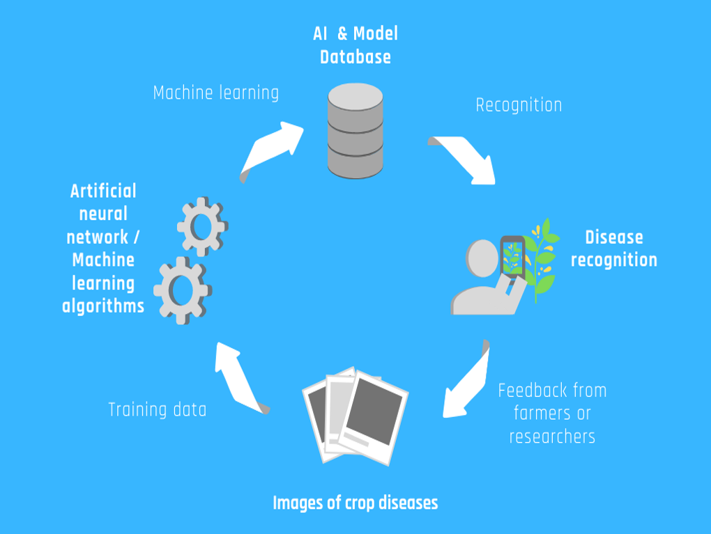

# CropAI: AI Crop Disease Recognition System
NEUON's submission for HackWknd AgroFest - CropAI

Members: Chang Yang Loong, Sophia Chulif, Heng Kiat Jing, Danish Ezwan

You can download the APK file here: 

https://github.com/coffeestains1908/neuon-hackwknd-cropai/releases/download/rc-0/apk.zip

Extract & install

## Project Description
Crop diseases impose a negative impact on the yield of crops and consequently lead to economic damage.
Human expertise such as plant pathologist are not always available in rural farms to detect the disease before the outbreak and spreading.
With the advancement of machine learning especially deep learning in visual recognition, there has been various successful cases where human expert knowledge can be transferred to the machine for assistant in visual recognition including plant diseases.
However, the direct adoption of such technology would raise new problems:
1. Existing plant disease data are not region invariant
2. Data required for deep learning task is large
3. Data needs to be diverse in terms of capturing condition, disease stages and image quality
 
In order to tackle the challenges mentioned, we propose a system that encapsulates the whole process from data collection to continuously growing crop disease recognition model as shown in Figure 1. The farmers and users would participate in data collection via App created by CropAI which is complete with labelling UI for meta information. These data will later be processed by the expert to either label or validate the images. Then, these annotated images are used to train and update an existing model of crop disease. Finally, the AI model is deployed/updated in the form of App for the farmer to recognize various diseases. The cycle continues as the farmers continuously submit their detected data and disease queries via the same App to enrich the crop disease data to produce a better AI model.
 
There are a few notable outcomes of CropAI:
1. Produce a reliable and continuously learning AI for crop disease.
2. Reduce the cost of data collection by crowdsourcing the community.
3. Farmers would be benefited by this system in early detection of crop disease to ensure quality yield at the same time maintain production quantity.
4. The related agriculture authority could detect and control disease outbreak within the community.

## Overall framework

  
  Figure 1

## About us
Neuon AI is a Sarawak based AI solution company specialize in machine learning, computer vision and Internet of Things (IoT). Visit us at www.neuon.ai for more information regarding our projects.
